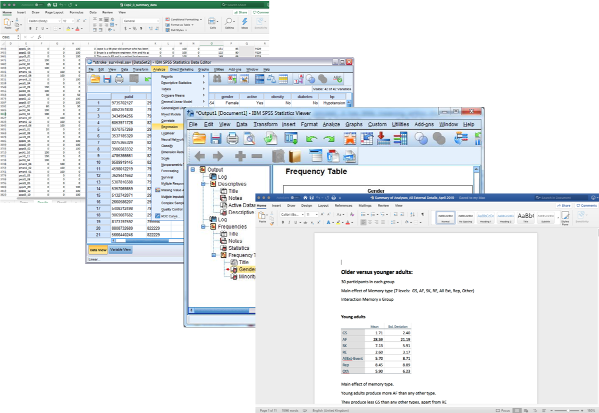
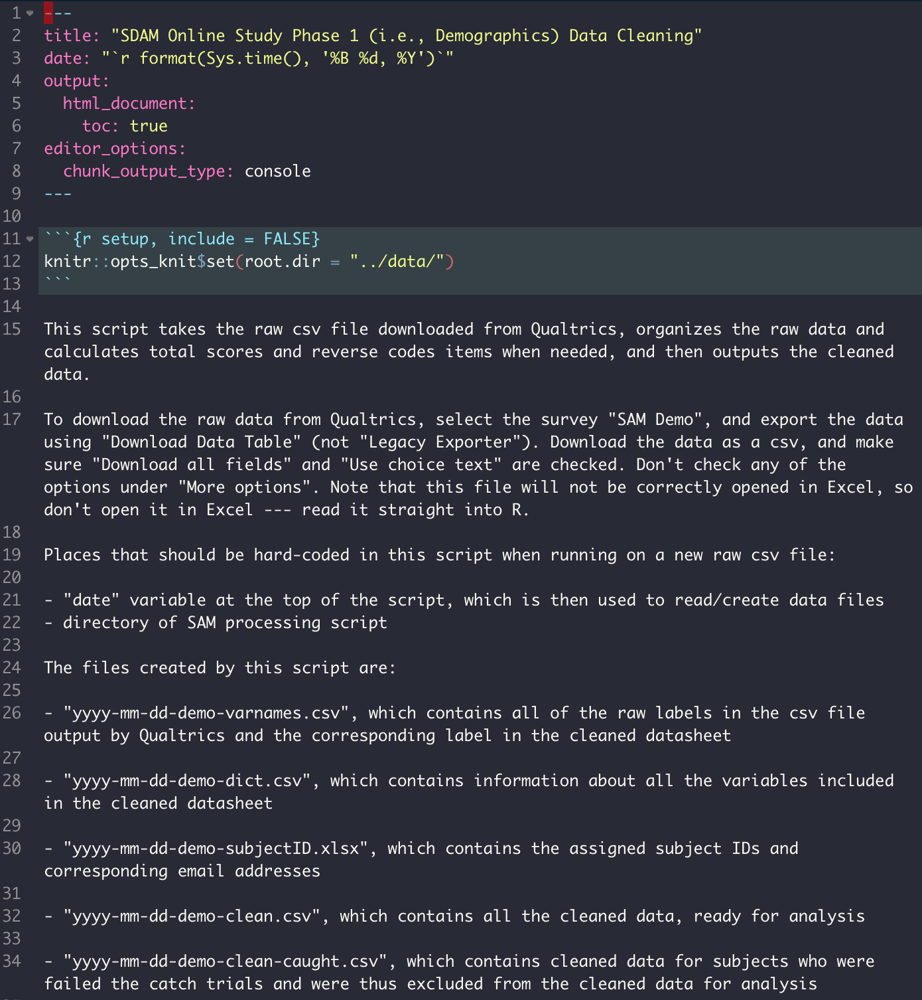
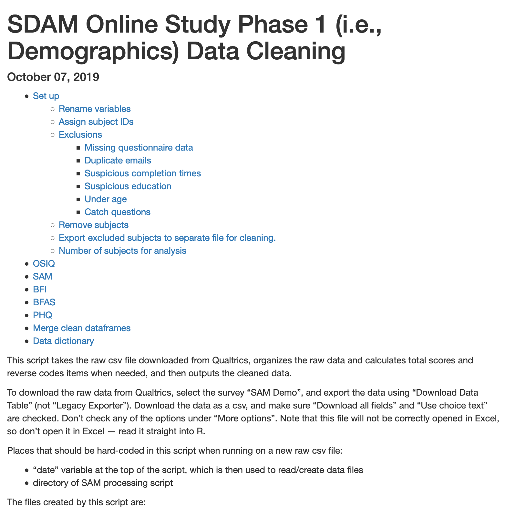
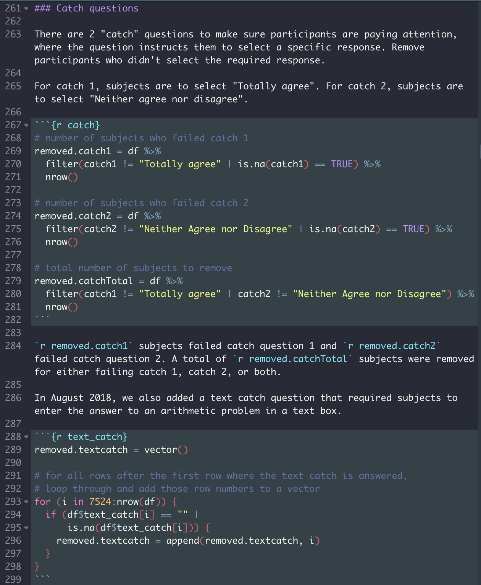
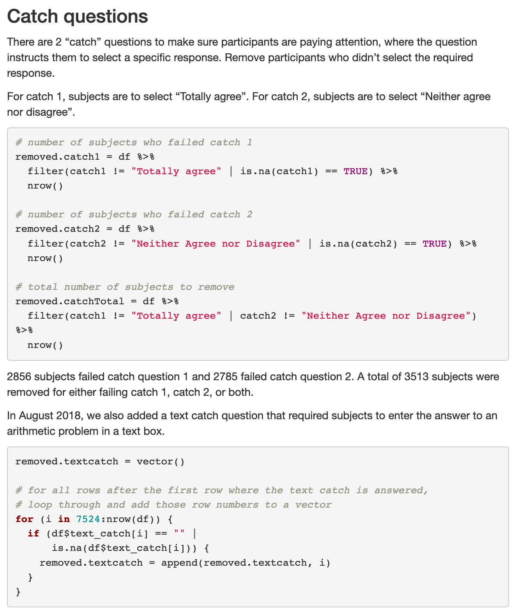
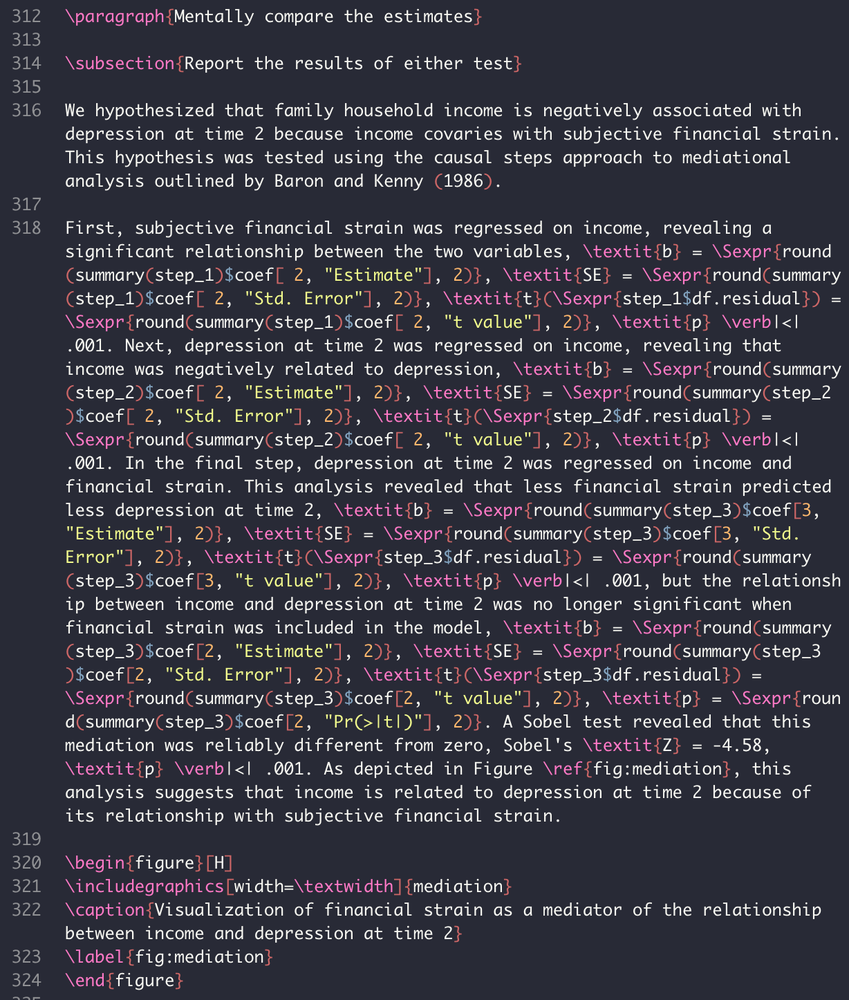
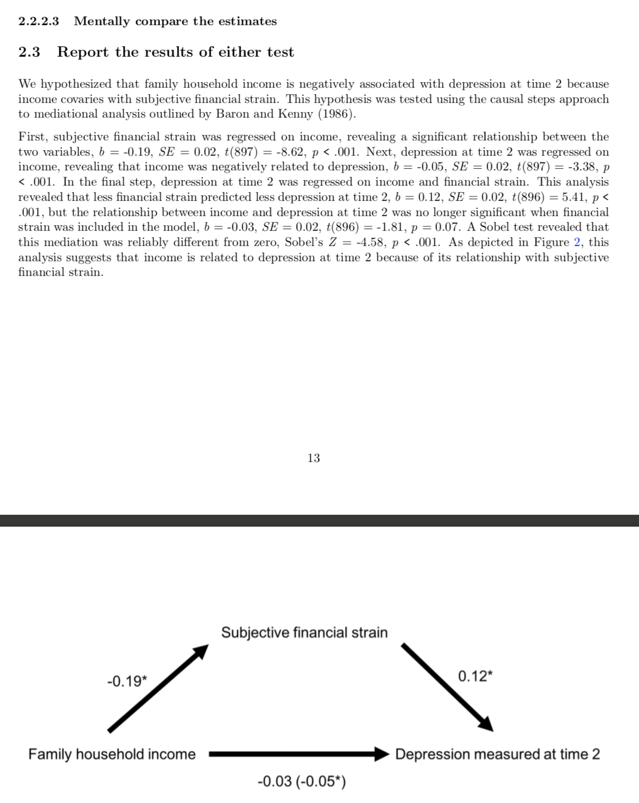

```{r setup, include=FALSE}
knitr::opts_chunk$set(echo = FALSE)
```

# Today's materials

Code, slides, (and code for these slides!) and resources are always available on my Github:

https://github.com/carinafan/workshops

---

class: inverse, center, middle

# Why use R Markdown?

---

# A typical analysis pipeline

```{r echo = FALSE, out.width = 700, out.height = 475}

```

---

# Problems with the previous pipeline

--

- Confusing and messy

--

- Capacity for human error

--

- Not easy to remember or share what exactly was done at each analysis step

--

You can try to circumvent some of these issues, e.g., with a well-commented analysis script, but there are still many pieces in the pipeline where errors can easily crop up undetected. 

---
class: inverse, center, middle

# **knitr**: an R package for reproducible research

???

R Markdown and the R package knitr allow you to integrate all of those steps with a single document that is easy to track and share with future you and collaborators. 

---

# **knitr**: an R package for reproducible research

--

.pull-left[
```{r echo = FALSE, out.height = 450, out.width = 775}

```
]

--

.pull-right[
```{r echo = FALSE, out.height = 450, out.width = 600}

```
]

???

- Allows you to create a single written report with embedded code, figures, tables, etc.
- Report can have a clickable table of contents, numbered figures, you can evaluate lines of code in-line with text so that you’re not copying and pasting values from outputs into reports, etc.
- Creates a clean, well-documented record of the analyses you’ve done and makes it easy to discuss and share with others — in HTML, PDF, slides, and other formats

---

# Creating reports with **knitr**

--

- Basic idea: a regular text document with chunks of code embedded within

--

- The text document can be written in **Markdown (.Rmd)** or LaTeX (.Rnw)

--

.pull-left[
```{r echo = FALSE, out.height = 365, out.width = 340}

```
]

--

.pull-right[
```{r echo = FALSE, out.height = 355, out.width = 315}

```
]

---

# Creating reports with **knitr**

- Basic idea: a regular text document with chunks of code embedded within

- The text document can be written in Markdown (.Rmd) or **LaTeX (.Rnw)**

.pull-left[
```{r out.height = 365, out.width = 340}

```
]

.pull-right[
```{r out.height = 365, out.width = 340}

```
]

---

# What does **knitr** do with the text file?

--

- Once you’ve written up the text, knitr takes the .Rmd or .Rnw text file and compiles it for you into a single document

--

- During knitr processing, a new environment is created in R and the code chunks are executed, with the output inputted into your document (if you want it to be)

--

- This done intentionally, as accidentally referencing objects in the global environment is an easy way to break a reproducible analysis

--

- If you want a plain .R script after writing up your report, you can extract only the code chunks from your file using `purl()`

???

- If you want to be able to save and document the output of your analyses while you’re still developing the code, then you can use version control with R Projects and Git, which I can also go over if people are interested in that
- For today I’ll focus on using R Markdown to create reports with knitr (i.e., .Rmd files), but I can also talk a bit about LaTeX or .Rnw files and the similarities and differences later if people are interested

---
class: inverse, center, middle

# Markdown and LaTeX

---

# What is Markdown?

markdownguide.org/getting-started

--

- A lightweight markup language for adding formatting elements to plaintext documents

--

- In an application like Microsoft Word, you click buttons to format words and phrases. In Markdown, you add syntax to the text to indicate which words and phrases should look different.

--

.pull-left[
```


## This is a subheader.


I can use syntax in plaintext files to 
make things **bold** or *italic*.
```
]

.pull-right[
## This is a subheader.

I can use syntax in plaintext files to make things **bold** or *italic*.
]

---

# R Markdown: an extension of Markdown

Uses basic Markdown syntax, but allows you to embed R (or Python, or SQL, or bash…) code chunks.

Instead of writing a .R script or a .md text file, you combine these elements in a .Rmd file that includes both R code and Markdown syntax.

---

# LaTeX and .Rnw files

Similar in principle to Markdown (i.e., using syntax to format text), but much more flexible (and complicated).

The equivalent of a .Rmd file for LaTeX is a .Rnw file. It's basically the same, only it uses LaTeX syntax instead of Markdown syntax to format the text.

---

class: inverse, center, middle

# What can I use R Markdown for?

---

class: center, middle

# Data cleaning

---

class: center, middle

# Data analysis

---

class: center, middle

# Analysis reports

---

class: center, middle

# Stats homework\*

\*We do NOT expect you to do your homework in R Markdown -- it is 100% not necessary to use R Markdown in order to meet the expectations of this class. But it's a relatively low-pressure situation with simple data and analyses to give you an opportunity to try to start figuring this stuff out, if that's what floats your boat.

---

class: center, middle

# Presentations

Like this one! I used `xaringan`. 

---

class: center, middle 

# And even manuscripts! 

Check out the `papaja` package.


---

# Resources

A concise guide that was really helpful for me when I was learning these tools:

https://kbroman.org/knitr_knutshell/ 

A short list of other resources I’ve put together are at:

https://tinyurl.com/rmarkdown-resources

Slides and other materials from today are on my Github:

https://github.com/carinafan/workshops


And please always feel free to get in touch with me about anything R or R Markdown related, and I'll be happy to do my best to point you in the right direction:

carina.fan@mail.utoronto.ca 

